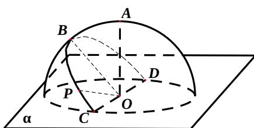

<!-- question-source:start -->
10、如图，半径为 R 的半球 O 的底面圆 O 在平面 $\alpha$ 内，过点 O 作平面 $\alpha$ 的垂线交半球面于点 A，过圆 O 的直径 CD 作平面 $\alpha$ 成 $45^{\circ}$ 角的平面与半球面相

交, 所得交线上到平面 $\alpha$ 的距离最大的点为 $B$ , 该交线上的一点 $P$ 满足 $\angle BOP = 60^{\circ}$ , 则 $A$ 、 $P$ 两点间的球面距离为 ( )

A、 $R \arccos \frac{\sqrt{2}}{4}$ B、 $\frac{\pi R}{4}$ C、 $R \arccos \frac{\sqrt{3}}{3}$ D、 $\frac{\pi R}{3}$
<!-- question-source:end -->

![[高中/真题/按年份分类/2012/2012年四川高考文科数学试卷_word版_和答案/选择题/题目/answers/Q00026574A1.md]]
