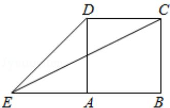

> [!faq]- 2012年四川高考文科数学试卷(word版)和答案解析
>
> > [!success]- **【答案】** B
>
> > [!note]- **【分析】**
> > 法一：用余弦定理在三角形 CED 中直接求角的余弦，再由同角三角关系求正弦；法二：在三角形 CED 中用正弦定理直接求正弦.
>
> > [!note]- **【解析】**
> > 分析：法一：用余弦定理在三角形 CED 中直接求角的余弦，再由同角三角关系求正弦；法二：在三角形 CED 中用正弦定理直接求正弦.
> >
> > 解答：解：法一：利用余弦定理
> >
> > 在 $\triangle CED$ 中，根据图形可求得 $ED=\sqrt{2}$ ， $CE=\sqrt{5}$ ，
> >
> > 由余弦定理得 $\cos \angle \mathrm{CED} = \frac{5 + 2 - 1}{2\times\sqrt{2}\times\sqrt{5}} = \frac{3\sqrt{10}}{10},$
> >
> > $$
> > \therefore \sin \angle C E D = \sqrt {1 - \frac {9}{1 0}} = \frac {\sqrt {1 0}}{1 0}.
> > $$
> >
> > 故选B.
> >
> > 法二：在 $\triangle CED$ 中，根据图形可求得 $ED = \sqrt{2}$ ， $CE = \sqrt{5}$ ， $\angle CDE = 135^\circ$
> >
> > 由正弦定理得 $\frac{\mathrm{CE}}{\sin\angle\mathrm{CDE}} = \frac{\mathrm{CD}}{\sin\angle\mathrm{CED}}$ ，即
> >
> > $$
> > \sin \angle C E D = \frac {C D \sin \angle C D E}{C E} = \frac {\sin 1 3 5 ^ {\circ}}{\sqrt {5}} = \frac {\sqrt {1 0}}{1 0}.
> > $$
> >
> > 故选B.
> >
> > 
> >
> > 点评：本题综合考查了正弦定理和余弦定理，属于基础题，题后要注意总结做题的规律.
