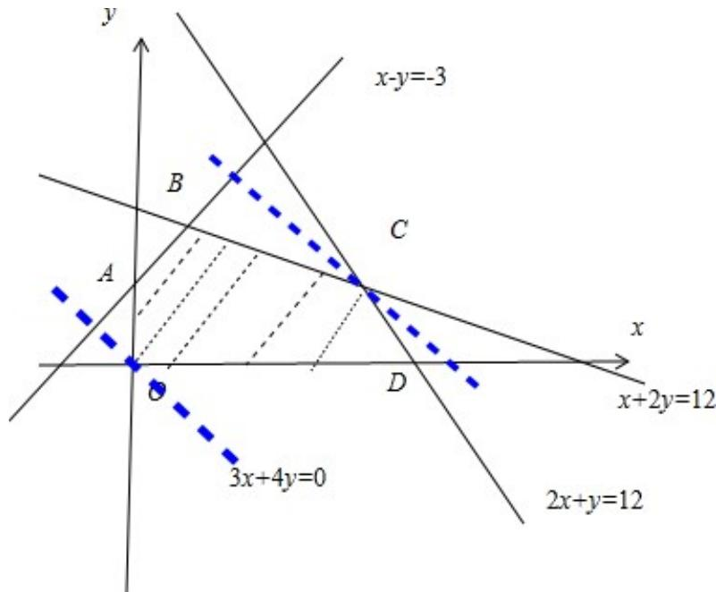

> [!faq]- 2012年四川高考文科数学试卷(word版)和答案解析
>
> > [!success]- **【答案】** C
>
> > [!note]- **【分析】**
> > 先画出约束条件的可行域，再求出可行域中各角点的坐标，将各点坐标代入目标函数的解析式，分析后易得目标函数 $z = 3x + 4y$ 的最大值.
>
> > [!note]- **【解析】**
> > 解：作出约束条件 $\left\{\begin{aligned}x-y&\geqslant-3\\ x+2y&\leqslant12\\ 2x+y&\leqslant12\\ x&\geqslant0\\ y&\geqslant0\end{aligned}\right.$ ，所示的平面区域，
> >
> > 作直线 $3\mathrm{x} + 4\mathrm{y} = 0$ ，然后把直线L向可行域平移，结合图形可知，平移到点C时z最大由 $\left\{ \begin{array}{l}x + 2y = 12\\ 2x + y = 12 \end{array} \right.$ 可得C（4，4），此时 $z = 28$
> >
> > 故选C
> >
> > 
> >
> > 点评：本题主要考查了线性规划的简单应用，解题的关键是，明确目标函数的几何意义
