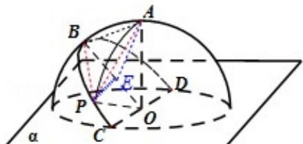

> [!faq]- 2012年四川高考文科数学试卷(word版)和答案解析
>
> > [!success]- **【答案】** A
>
> > [!note]- **【分析】**
> > 由题意求出 AP 的距离，然后求出 $\angle AOP$ ，即可求解 A、P 两点间的球面距离.
>
> > [!note]- **【解析】**
> > 解: 半径为 R 的半球 O 的底面圆 O 在平面 $\alpha$ 内, 过点 O 作平面 $\alpha$ 的垂线交半球面于点 A, 过圆 O 的直径 CD 作平面 $\alpha$ 成 $45^{\circ}$ 角的平面与半球面相交, 所得交线上到平面 $\alpha$ 的距离最大的点为 B, 所以 CD⊥平面 AOB,
> >
> > 因为 $\angle BOP = 60^{\circ}$ , 所以 $\triangle OPB$ 为正三角形, P 到 BO 的距离为 $PE = \frac{\sqrt{3}}{2}R$ , E 为 BQ 的中
> >
> > 点, $AE = \sqrt{R^{2} + (\frac{R}{2})^{2} - 2AO \cdot OE\cos45^{\circ}} = \sqrt{\frac{5 - 2\sqrt{2}}{4}}R$ ,
> >
> > AP = $\sqrt{(\frac{\sqrt{3}}{2}R)^{2} + (\sqrt{\frac{5 - 2\sqrt{2}}{4}}R)^{2}} = \frac{\sqrt{8 - 2\sqrt{2}}}{2}R$ ,
> >
> > AP² = OP² + OA² - 2OP·OA cos ∠AOP, $\frac{8 - 2\sqrt{2}}{4}R^{2} = R^{2} + R^{2} - 2R^{2}\cos\angle AOP$ ,
> >
> > cos ∠AOP = $\frac{\sqrt{2}}{4}$ , ∠AOP = arccos $\frac{\sqrt{2}}{4}$ ,
> >
> > A、P 两点间的球面距离为 Rarccos $\frac{\sqrt{2}}{4}$ ,
> >
> > 故选 A.
> >
> > 
> >
> > 点评：本题考查反三角函数的运用，球面距离及相关计算，考查计算能力以及空间想象能力.
