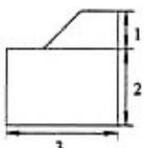
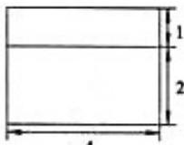
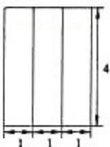

<!-- question-source:start -->
10. （2012·天津）一个几何体的三视图如图所示（单位：m），则该几何体的体积为 \_\_\_\_ $m^{3}$ .

  
正视图

  
侧视图

  
俯视图
<!-- question-source:end -->

![[高中/真题/按年份分类/2012/2012年天津高考文科数学试题及答案_Word版_/填空题/题目/answers/Q00023710A1.md]]
