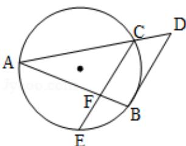

<!-- question-source:start -->
13. (2012·天津) 如图, 已知 AB 和 AC 是圆的两条弦, 过点 B 作圆的切线与 AC 的延长线相交于点 D, 过点 C 作 BD 的平行线与圆相交于点 E, 与 AB 相交于点 F, AF=3, FB=1, EF= $\frac{3}{2}$ , 则线段 CD 的长为 \_\_\_\_.

<!-- question-source:end -->

![[高中/真题/按年份分类/2012/2012年天津高考文科数学试题及答案_Word版_/填空题/题目/answers/Q00023713A1.md]]
