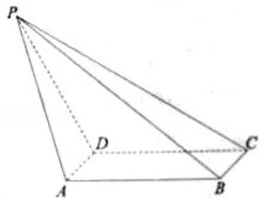

<!-- question-source:start -->
17. （2012·天津）如图，在四棱锥 P-ABCD 中，底面 ABCD 是矩形，AD⊥PD，BC=1，PC=2√3，PD=CD=2.

(1) 求异面直线 PA 与 BC 所成角的正切值；

(2) 证明：平面 PDC⊥平面 ABCD;

(3) 求直线 PB 与平面 ABCD 所成角的正弦值.

<!-- question-source:end -->

![[高中/真题/按年份分类/2012/2012年天津高考文科数学试题及答案_Word版_/填空题/题目/answers/Q00023717A1.md]]
