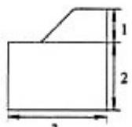
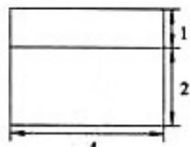
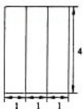

> [!faq]- 2012年天津高考文科数学试题及答案(Word版)解析
>
> > [!success]- **【答案】** 为：30.  正视图   侧视图 俯视图 点评：本题考查三视图与几何体的关系，判断三视图复原的几何体的形状是解题的关键，考查空间想象能力与计算能力.
>
> > [!note]- **【分析】**
> > 通过三视图判断几何体的特征，利用三视图的数据，求出几何体的体积即可.
>
> > [!note]- **【解析】**
> > 分析：通过三视图判断几何体的特征，利用三视图的数据，求出几何体的体积即可.
> >
> > 解答：解：由三视图可知几何体是组合体，下部是长方体，底面边长为3和4，高为2，
> >
> > 上部是放倒的四棱柱，底面为直角梯形，底面直角边长为2和1，高为1，棱柱的高为4，所以几何体看作是放倒的棱柱，底面是5边形，
> >
> > 几何体的体积为： $(2\times 3 + \frac{1 + 2}{2}\times 1)\times 4 = 30(\mathrm{m}^3)$
> >
> > 故
> > 答案为：30.
> >
> >   
> > 正视图
> >
> > 
> >
> >   
> > 侧视图  
> > 俯视图
> >
> > 点评：本题考查三视图与几何体的关系，判断三视图复原的几何体的形状是解题的关键，考查空间想象能力与计算能力.
