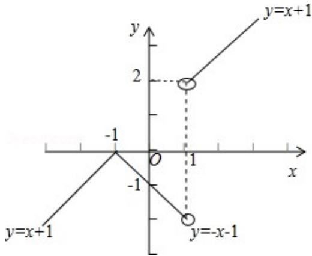

> [!faq]- 2012年天津高考文科数学试题及答案(Word版)解析
>
> > [!success]- **【答案】** （0，1）∪（1，2）。
>
> > [!note]- **【分析】**
> > 函数 $y = \frac{|x^2 - 1|}{x - 1} = \frac{|x + 1| \cdot |x - 1|}{x - 1} = \begin{cases} x + 1, & x > 1 \\ -(x + 1), & -1 \leqslant x < 1 \\ x + 1, & x < -1 \end{cases}$ ，如图所示，可得直线 $y = kx$ 与函数 $y = \frac{|x^2 - 1|}{x - 1}$ 的图象相交于两点时，直线的斜率 $k$ 的取值范围.
>
> > [!note]- **【解析】**
> > 解：函数 $y = \frac{|x^2 - 1|}{x - 1} = \frac{|x + 1| \cdot |x - 1|}{x - 1} = \begin{cases} x + 1, & x > 1 \\ -(x + 1), & -1 \leqslant x < 1 \\ x + 1, & x < -1 \end{cases}$ ，如图所示：
> >
> > 
> >
> > 故当一次函数 $y = kx$ 的斜率 $k$ 满足 $0 < k < 1$ 或 $1 < k < 2$ 时，直线 $y = kx$ 与函数 $y = \frac{|x^2 - 1|}{x - 1}$ 的图象相交于两点，故答案为（0，1）∪（1，2）。
> >
> > 点评：本题主要考查函数的零点的定义，函数的零点与方程的根的关系，体现了转化、数形结合的数学思想，属于基础题.
> >
> > ##
