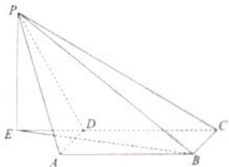

> [!faq]- 2012年天津高考文科数学试题及答案(Word版)解析
>
> > [!success]- **【答案】** 详见解析
>
> > [!note]- **【分析】**
> > （1）判断 $\angle$ PAD为异面直线PA与BC所成角，在Rt△PDA中，求异面直线PA与BC所成角的正切值；
> > (2) 说明 AD⊥BC，通过 AD⊥PD，CD∩PD=D，证明 AD⊥平面 PDC，然后证明平面 PDC⊥平面 ABCD.
> > (3) 在平面 PDC 中, 过点 P 作 PE⊥CD 于 E, 连接 EB. 说明∠PBE 为直线 PB 与平面 ABCD 所成角, 求出 PE, PB, 在 Rt△PEB 中, 通过 sin∠PBE = $\frac{PE}{PB}$ 求直线 PB 与平面 ABCD 所成角的正弦值.
>
> > [!note]- **【解析】**
> > （1）解：如图，在四棱锥 P - ABCD 中，
> >
> > 因为底面 ABCD 是矩形，所以 AD=BC，且 AD∥BC，
> >
> > 又因为 AD⊥PD，
> >
> > 故 $\angle PAD$ 为异面直线PA与BC所成角，
> >
> > 在 Rt△PDA 中， $\tan\angle PAD=\frac{PD}{AD}=2$ ，
> >
> > 所以异面直线 PA 与 BC 所成角的正切值为：2.
> > (2) 证明: 由于底面 ABCD 是矩形, 故 AD⊥BC,
> >
> > 由于 AD⊥PD，CD∩PD=D，
> >
> > 因此 AD⊥平面 PDC，而 ADC 平面 ABCD，所以平面 PDC⊥平面 ABCD.
> > (3) 解: 在平面 PDC 中, 过点 P 作 PE⊥CD 于 E, 连接 EB.
> >
> > 由于平面 PDC⊥平面 ABCD，
> >
> > 而直线 CD 是平面 PDC 与平面 ABCD 的交线，
> >
> > 故 PE⊥平面 ABCD.
> >
> > 由此得 $\angle PBE$ 为直线 PB 与平面 ABCD 所成角，
> >
> > 在 $\triangle \mathrm{PDC}$ 中，
> >
> > 由于 PD=CD=2，PC= $2\sqrt{3}$ ，可得 $\angle PCD=30^{\circ}$ ，
> >
> > 在 Rt△PEC 中，PE=PCsin30°= $\sqrt{3}$ .
> >
> > 由 AD∥BC，AD⊥平面 PDC，得 BC⊥平面 PDC，
> >
> > 因此 BC⊥PC.
> >
> > 在 Rt△PCB 中， $\mathrm{PB} = \sqrt{\mathrm{PC}^2 + \mathrm{BC}^2} = \sqrt{13}$ .
> >
> > 在 Rt△PEB 中， $\sin\angle PBE=\frac{PE}{PB}=\frac{\sqrt{39}}{13}$ .
> >
> > 所以直线 PB 与平面 ABCD 所成角的正弦值为 $\frac{\sqrt{39}}{13}$ .
> >
> > 
> >
> > 点评：本题考查直线与平面所成的角，异面直线及其所成的角，平面与平面垂直的判定，考查空间想象能力，计算能力.
