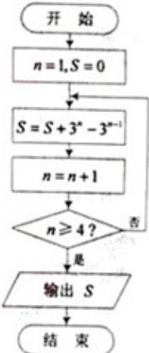

<!-- question-source:start -->
3. （2012·天津）阅读右边的程序框图，运行相应的程序，则输出 s 的值为（）

A. 8 B. 18 C. 26 D. 80
<!-- question-source:end -->

![[高中/真题/按年份分类/2012/2012年天津高考文科数学试题及答案_Word版_/选择题/题目/answers/Q00023703A1.md]]
