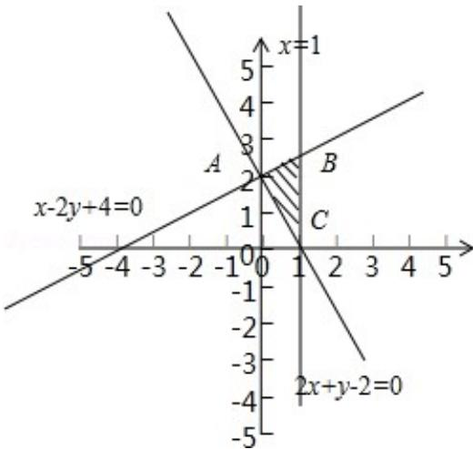

> [!faq]- 2012年天津高考文科数学试题及答案(Word版)解析
>
> > [!success]- **【答案】** B
>
> > [!note]- **【分析】**
> > 先画出线性约束条件对应的可行域，再将目标函数赋予几何意义，数形结合即可得目标函数的最小值
>
> > [!note]- **【解析】**
> > 分析：先画出线性约束条件对应的可行域，再将目标函数赋予几何意义，数形结合即可得目标函数的最小值
> > 解答：解：画出可行域如图阴影区域：
> > 目标函数 z=3x-2y 可看做 $y=\frac{3}{2}x-\frac{1}{2}z$ ，即斜率为 $\frac{3}{2}$ ，截距为 $-\frac{1}{2}z$ 的动直线，
> > 数形结合可知，当动直线过点 A 时，z 最小
> > 由 $\left\{\begin{aligned}&2x+y-2=0\\&x-2y+4=0\end{aligned}\right.$ 得 A (0, 2)
> > ∴ 目标函数 z=3x-2y 的最小值为 $z=3\times0-2\times2=-4$ 故选 B
> >
> > 
> >
> > 点评：本题主要考查了线性规划的思想方法和解题技巧，二元一次不等式组表示平面区域，数形结合的思想方法，属基础题
