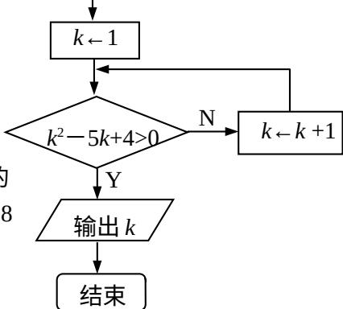

<!-- question-source:start -->
6. 现有 10 个数, 它们能构成一个以 1 为首项, -3 为公比的等比数列, 若从这 10 个数中随机抽取一个数, 则它小于 8 的概率是 ▲.

  
(第4题)
<!-- question-source:end -->

![[高中/真题/按年份分类/2012/2012年江苏高考数学试题及答案/填空题/题目/answers/Q00026681A1.md]]
