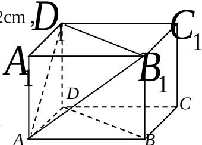

<!-- question-source:start -->
8. 在平面直角坐标系 $xOy$ 中，若双曲线 $\frac{x^2}{m} - \frac{y^2}{m^2 + 4} = 1$ 的离心率为 $\sqrt{5}$ ，则 $m$ 的值为 ▲。

  
(第7题)
<!-- question-source:end -->

![[高中/真题/按年份分类/2012/2012年江苏高考数学试题及答案/填空题/题目/answers/Q00026683A1.md]]
