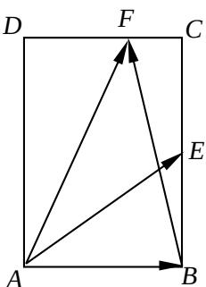

<!-- question-source:start -->
10. 设 $f(x)$ 是定义在 $\mathbf{R}$ 上且周期为 2 的函数，在区间 $[-1, 1]$ 上，

$f(x)=\left\{\begin{aligned}&ax+1,-1\leq x<0,\\&\frac{bx+2}{x+1},0\leq x\leq 1\end{aligned}\right.$ ，其中 $a,b\in R$ 。若 $f\left(\frac{1}{2}\right)=f\left(\frac{3}{2}\right)$

(第9题)

则 $a + 3b$ 的值为 ▲.
<!-- question-source:end -->

![[高中/真题/按年份分类/2012/2012年江苏高考数学试题及答案/填空题/题目/answers/Q00026685A1.md]]
