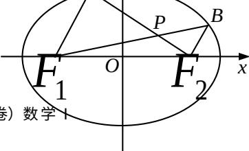

<!-- question-source:start -->
## 19. (本小题满分 16 分)

如图，在平面直角坐标系 $xOy$ 中，椭圆 $\frac{x^2}{a^2} +\frac{y^2}{b^2} = 1(a > b > 0)$ 的左、右焦点分别为 $F_{1}(-c,0), F_{2}(c,0)$ ，已知 $(1,e)$ 和 $\left(e,\frac{\sqrt{3}}{2}\right)$ 都在椭圆上，其中 $e$ 为椭圆的离心率.

(1) 求椭圆的离心率;

  
(第19题)

(2) 设 $A, B$ 是椭圆上位于 $x$ 轴上方的两点，且直线 $AF_{1}$

与直线 $BF_{2}$ 平行， $AF_{2}$ 与 $BF_{1}$ 交于点 P.

(i) 若 $AF_{1} - BF_{2} = \frac{\sqrt{6}}{2}$ ，求直线 $AF_{1}$ 的斜率；

(ii) 求证: $PF_{1} + PF_{2}$ 是定值.
<!-- question-source:end -->

![[高中/真题/按年份分类/2012/2012年江苏高考数学试题及答案/填空题/题目/answers/Q00029773A1.md]]
