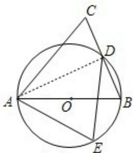

> [!faq]- 2012年江苏高考数学试题及答案解析
>
> > [!success]- **【答案】** 详见解析
>
> > [!note]- **【分析】**
> > 法（选修）.
>
> > [!note]- **【解析】**
> > A. 证明: 连接 AD.
> >
> > A. 证明：连接AD.
> >
> > ∵AB是圆O的直径，∴∠ADB=90°（直径所对的圆周角是直角）.
> >
> > ∴AD⊥BD（垂直的定义）.
> >
> > 又∵BD=DC，∴AD是线段BC的中垂线（线段的中垂线定义）.
> >
> > ∴AB=AC（线段中垂线上的点到线段两端的距离相等）.
> >
> > ∴∠B=∠C（等腰三角形等边对等角的性质）.
> >
> > 又∵D，E为圆上位于AB异侧的两点，
> >
> > ∴∠B=∠E（同弧所对圆周角相等）.
> >
> > ∴∠E=∠C（等量代换）.
> >
> > B、解：∵矩阵A的逆矩阵 $A^{-1}=\begin{bmatrix}-\frac{1}{4}\frac{3}{4}\\ \frac{1}{2}&-\frac{1}{2}\end{bmatrix}$ ，∴ $A=(A^{-1})^{-1}=\begin{bmatrix}2&3\\ 2&1\end{bmatrix}$ ∴f(λ)= $\left|\begin{matrix}\lambda-2&-3\\ -2&\lambda-1\end{matrix}\right|=\lambda^{2}-3\lambda-4=0$
> >
> > $\therefore \lambda_{1} = -1, \lambda_{2} = 4$
> >
> > C、解：∵圆心为直线 $\rho\sin\left(\theta-\frac{\pi}{3}\right)=-\frac{\sqrt{3}}{2}$ 与极轴的交点，
> >
> > ∴在 $\rho\sin\left(\theta-\frac{\pi}{3}\right)=-$ 中令 $\theta=0$ ，得 $\rho=1$ ．∴圆 C 的圆心坐标为 $(1,0)$ ．
> >
> > $\because$ 圆C经过点P（ $\sqrt{2}$ ， $\frac{\pi}{4}$ ），∴圆C的半径为PC=1.
> >
> > ∴圆的极坐标方程为 $\rho=2\cos\theta$ .
> >
> > D、证明：∵3|y|=|3y|=|2 (x+y) - (2x-y) |≤2|x+y|+|2x-y|, |x+y|< $\frac{1}{3}$ , |2x-y|< $\frac{1}{6}$ ,
> > ∴3|y|< $\frac{2}{3}+\frac{1}{6}=\frac{5}{6}$ ,
> > ∴|y|< $\frac{5}{18}$
> >
> >   
> > (A)
> >
> > 点评：本题是选作题，综合考查选修知识，考查几何证明选讲、矩阵与变换、坐标系与参数方程、不等式证明，综合性强
