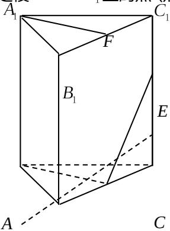
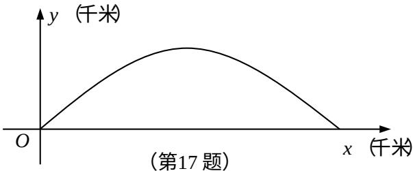

<!-- question-source:start -->
16. （本小题满分 14 分）

如图, 在直三棱柱 $ABC - A_{1}B_{1}C_{1}$ 中, $A_{1}B_{1} = A_{1}C_{1}$ , $D', E$ 分别是棱 $BC', CC_{1}$ 上的点 (点 $D$

不同于点 C），且 $AD \perp DE, F$ 为 $B_{1}C_{1}$ 的中点.

求证：（1）平面 $ADE \perp$ 平面 $BCC_{1}B_{1}$ ；

(2) 直线 $A_{1}F \parallel$ 平面 ADE.

D

(第 16 题)

## 17. （本小题满分 14 分）

如图, 建立平面直角坐标系 $xOy$ , $x$ 轴在地平面上, $y$ 轴垂直于地平面, 单位长度为 1 千米. 某炮位于坐标原点. 已知炮弹发射后的轨迹在方程 $y = kx - \frac{1}{20}(1 + k^2)x^2 (k > 0)$ 表示的曲线上, 其中 $k$ 与发射方向有关. 炮的射程是指炮弹落地点的横坐标.

(1) 求炮的最大射程;

(2) 设在第一象限有一飞行物 (忽略其大小), 其飞行高度为 3.2 千米, 试问它的横坐标 $a$ 不超过多少时, 炮弹可以击中它? 请说明理由.

## 18. (本小题满分 16 分)

若函数 $y = f(x)$ 在 $x = x_{0}$ 取得极大值或者极小值则 x = x0 是 $y = f(x)$ 的极值点已知 a, b 是实数，1 和 -1 是函数 $f(x) = x^{3} + ax^{2} + bx$ 的两个极值点.

(1) 求 a 和 b 的值;

(2) 设函数 $g(x)$ 的导函数 $g'(x) = f(x) + 2$ ，求 $g(x)$ 的极值点；

(3) 设 $h(x)=f(f(x))-c$ ，其中 $c\in[-2,2]$ ，求函数 $y=h(x)$ 的零点个数.

## 19. (本小题满分 16 分)

如图，在平面直角坐标系 $xOy$ 中，椭圆 $\frac{x^2}{a^2} +\frac{y^2}{b^2} = 1(a > b > 0)$ 的左、右焦点分别为 $F_{1}(-c,0), F_{2}(c,0)$ ，已知 $(1,e)$ 和 $\left(e,\frac{\sqrt{3}}{2}\right)$ 都在椭圆上，其中 $e$ 为椭圆的离心率.

(1) 求椭圆的离心率;

  
(第19题)

(2) 设 $A, B$ 是椭圆上位于 $x$ 轴上方的两点，且直线 $AF_{1}$

与直线 $BF_{2}$ 平行， $AF_{2}$ 与 $BF_{1}$ 交于点 P.

(i) 若 $AF_{1} - BF_{2} = \frac{\sqrt{6}}{2}$ ，求直线 $AF_{1}$ 的斜率；

(ii) 求证: $PF_{1} + PF_{2}$ 是定值.

## 20. (本小题满分 16 分)

已知各项均为正数的两个数列 $\{a_{n}\}$ 和 $\{b_{n}\}$ 满足： $a_{n + 1} = \frac{a_n + b_n}{\sqrt{a_n^2 + b_n^2}}$ ， $n\in \mathbf{N}^*$

(1) 设 $b_{n+1} = 1 + \frac{b_n}{a_n}, n \in \mathbf{N}^*$ ，求证：数列 $\left\{\left(\frac{b_n}{a_n}\right)^2\right\}$ 是等差数列；

(2) 设 $b_{n+1} = \sqrt{2} \cdot \frac{b_n}{a_n}$ ， $n \in \mathbf{N}^*$ ，且 $\{a_n\}$ 是等比数列，求 $a_1$ 和 $b_1$ 的值.

## 注意事项

考生在答题前请认真阅读本注意事项及各题答题要求：
<!-- question-source:end -->

![[高中/真题/按年份分类/2012/2012年江苏高考数学试题及答案/解答题/题目/answers/Q00026691A1.md]]
