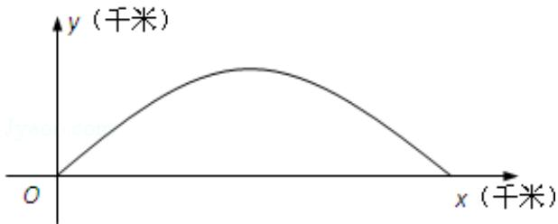

<!-- question-source:start -->
17. (14 分) (2012·江苏) 如图, 建立平面直角坐标系 xOy, x 轴在地平面上, y 轴垂直于地平面, 单位长度为 1 千米. 某炮位于坐标原点. 已知炮弹发射后的轨迹在方程 $y = kx - \frac{1}{20} \left(1 + k^2\right)x^2 (k > 0)$ 表示的曲线上, 其中 k 与发射方向有关. 炮的射程是指炮弹落地点的横坐标.

(1) 求炮的最大射程;

(2) 设在第一象限有一飞行物（忽略其大小），其飞行高度为 3.2 千米，试问它的横坐标 a 不超过多少时，炮弹可以击中它？请说明理由。

考点：函数模型的选择与应用.

专题：函数的性质及应用.
<!-- question-source:end -->

![[高中/真题/按年份分类/2012/2012年江苏高考数学试题及答案/解答题/题目/answers/Q00026694A1.md]]
