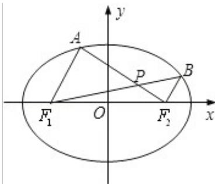

<!-- question-source:start -->
19. (16 分) (2012·江苏) 如图, 在平面直角坐标系 xOy 中, 椭圆 $\frac{x^2}{a^2} + \frac{y^2}{b^2} = 1 (a > b > 0)$ 的左、右焦点分别为 $F_1(-c, 0), F_2(c, 0)$ . 已知 $(1, e)$ 和 $(e, \frac{\sqrt{3}}{2})$ 都在椭圆上, 其中 $e$ 为椭圆的离心率.

(1) 求椭圆的方程;

(2) 设 A, B 是椭圆上位于 x 轴上方的两点, 且直线 $AF_{1}$ 与直线 $BF_{2}$ 平行, $AF_{2}$ 与 $BF_{1}$ 交于点 P.

(i) 若 $\mathrm{AF}_1 - \mathrm{BF}_2 = \frac{\sqrt{6}}{2}$ ，求直线 $\mathrm{AF}_1$ 的斜率；

(ii) 求证： $\mathrm{PF}_{1} + \mathrm{PF}_{2}$ 是定值.

考 直线与圆锥曲线的综合问题；直线的斜率；椭圆的标准方程.

专 圆锥曲线的定义、性质与方程.

题：
<!-- question-source:end -->

![[高中/真题/按年份分类/2012/2012年江苏高考数学试题及答案/解答题/题目/answers/Q00026696A1.md]]
