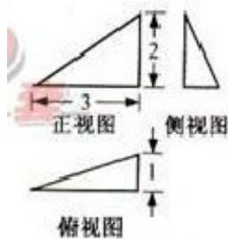

<!-- question-source:start -->
13. 设公比为 $q(q > 0)$ 的等比数列 $\left\{a_{n}\right\}$ 的前 $n$ 项和为 $S_{n}$ .

若 $S_{2} = 3a_{2} + 2$ ， $S_{4} = 3a_{4} + 2$ ，则 $q =$

  
(第11题图)
<!-- question-source:end -->

![[高中/真题/按年份分类/2012/2012年浙江高考数学_理科_试卷_含答案_/填空题/题目/answers/Q00023344A1.md]]
