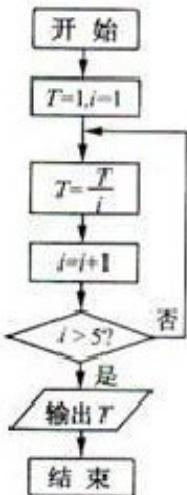

<!-- question-source:start -->
16. 定义：曲线 $C$ 上的点到直线的距离的最小值称为曲线 $C$ 到直线 $l$ 的距离。已知曲线 $C_1: y = x^2 + a$ 到直线 $l: y = x$ 的距离等于曲线 $C_2: x^2 + (y + 4)^2 = 2$ 到直线 $l: y = x$ 的距离，则实数 $a =$ ——。

  
(第12题图)
<!-- question-source:end -->

![[高中/真题/按年份分类/2012/2012年浙江高考数学_理科_试卷_含答案_/填空题/题目/answers/Q00023347A1.md]]
