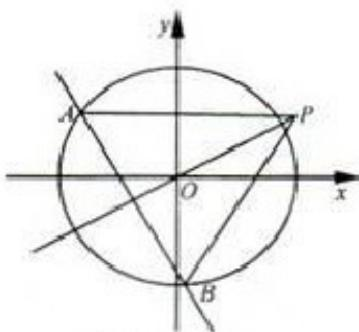

<!-- question-source:start -->
21. （本题满分 15 分）如图，椭圆 $C: \frac{x^{2}}{a^{2}} + \frac{y^{2}}{b^{2}} = 1 (a > b > 0)$ 的离心率为 $\frac{1}{2}$ ，其左焦点到点 $P(2, 1)$ 的距离为 $\sqrt{10}$ ，不过原点 O 的直线 l 与 C 相交于 A，B 两点，且线段 AB 被直线 OP 平分.

（Ⅰ）求椭圆 C 的方程；

（II）求 $\Delta ABP$ 面积取最大值时直线 l 的方程.

(第20题图)  
  
(第21题图)
<!-- question-source:end -->

![[高中/真题/按年份分类/2012/2012年浙江高考数学_理科_试卷_含答案_/填空题/题目/answers/Q00023352A1.md]]
