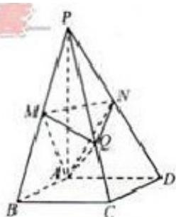

<!-- question-source:start -->
20. （本题满分 15 分）如图，在四棱锥 P - ABCD 中，底面是边长为 $2\sqrt{3}$ 的菱形， $\angle BAD = 120^{\circ}$ ，且 $PA \perp$ 平面 ABCD， $PA = 2\sqrt{6}$ ，M，N 分别为 PB，PD 的中点.

(Ⅰ) 证明: $MN \perp$ 平面 $ABCD$ ;

（II）过点 $A$ 作 $AQ \perp PC$ ，垂足为点 $Q$ ，求二面角 $A - MN - Q$ 的平面角的余弦值.
<!-- question-source:end -->

![[高中/真题/按年份分类/2012/2012年浙江高考数学_理科_试卷_含答案_/解答题/题目/answers/Q00023351A1.md]]
