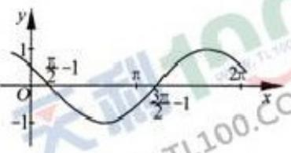
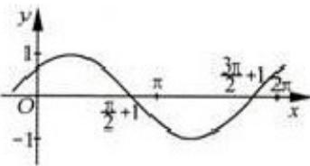
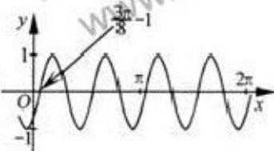
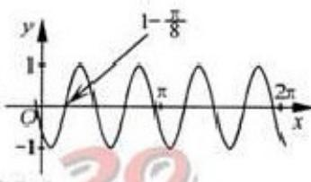

<!-- question-source:start -->
4. 把函数 $y = \cos 2x + 1$ 的图像上所有点的横坐标伸长到原来的 2 倍（纵坐标不变），然后向左平移 1 个单位长度，再向下平移 1 个单位长度，得到的图像是

A.

B.

C.

D.

<!-- question-source:end -->

![[高中/真题/按年份分类/2012/2012年浙江高考数学_理科_试卷_含答案_/选择题/题目/answers/Q00023335A1.md]]
