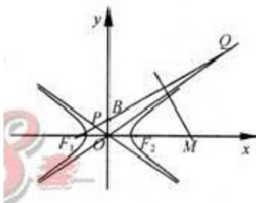

<!-- question-source:start -->
8. 如图， $F_{1}$ ， $F_{2}$ 分别是双曲线 $C: \frac{x^{2}}{a^{2}} - \frac{y^{2}}{b^{2}} = 1 (a, b > 0)$ 的
左、右两焦点，B 是虚轴的端点，直线 $F_{1}B$ 与 C 的两条渐近线分别交于 P，Q 两点，线段 PQ 的垂直平分线与 x 轴交于点 M．若 $|MF_{1}| \neq |F_{1}F_{2}|$ ，则 C 的离心率是
A. $\frac{2\sqrt{3}}{3}$ B. $\frac{\sqrt{6}}{2}$ C. $\sqrt{2}$ D. $\sqrt{3}$

  
(第8题图)
<!-- question-source:end -->

![[高中/真题/按年份分类/2012/2012年浙江高考数学_理科_试卷_含答案_/选择题/题目/answers/Q00023339A1.md]]
