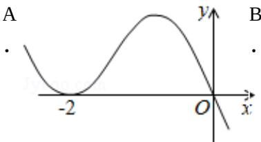
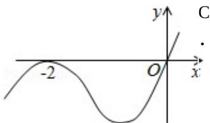
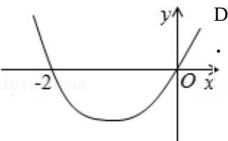
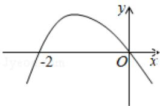

# 2012 年重庆市高考数学试卷（文科）

参考
答案与
试题
解析

##
一、选择题（共10小题，每小题5分，满分50分）

1. （5分）（2012·重庆）命题“若p则q”的逆命题是（）
A 若 q 则 p    B 若 $\neg p$ 则 $\neg q$ C 若 $\neg q$ 则 $\neg p$ D 若 p 则 $\neg q$

2. (5分) (2012·重庆) 不等式 $\frac{x - 1}{x + 2} < 0$ 的解集为（）A $(1, +\infty)$ B $(- \infty, -2)$ C $(-2, 1)$ D $(- \infty, -2)$ . 2) $\cup (1, +\infty)$

3. （5分）（2012·重庆）设A，B为直线 $y = x$ 与圆 $x^2 + y^2 = 1$ 的两个交点，则 $|AB| =$ （）
A 1    B $\sqrt{2}$ C $\sqrt{3}$ D 2
.    .    .    .

4. （5分）（2012·重庆）（1-3x） $^{5}$ 的展开式中 $x^{3}$ 的系数为（）
A - 270    B - 90    C 90    D 270
.    .    .    .

5. (5分) (2012·重庆) $\frac{\sin 47^{\circ} - \sin 17^{\circ}\cos 30^{\circ}}{\cos 17^{\circ}} = (\quad)$ A $-\frac{\sqrt{3}}{2}$ B $-\frac{1}{2}$ C $\frac{1}{2}$ D $\frac{\sqrt{3}}{2}$

6.（5分）(2012·重庆)设 $x\in R$ ，向量 $\vec{a}=(x,1)$ ， $\vec{b}=(1,-2)$ ，且 $\vec{a}\perp\vec{b}$ ，则 $|\vec{a}+\vec{b}|=()$ A $\sqrt{5}$ B $\sqrt{10}$ C $2\sqrt{5}$ D 10
. . .

7. (5分) (2012·重庆) 已知 $a = \log_23 + \log_2\sqrt{3}$ , $b = \log_29 - \log_2\sqrt{3}$ , $c = \log_32$ 则 $a, b, c$ 的大小关系是（ ）  
A $a = b < c$ B $a = b > c$ C $a < b < c$ D $a > b > c$

8. (5 分) (2012·重庆) 设函数 $f(x)$ 在 $R$ 上可导, 其导函数为 $f'(x)$ , 且函数 $f(x)$ 在 $x = -2$ 处取得极小值, 则函数 $y = xf'(x)$ 的图象可能是 ( )

9. (5 分) (2012·重庆) 设四面体的六条棱的长分别为 1, 1, 1, 1, $\sqrt{2}$ 和 a，且长为 a 的棱与长为 $\sqrt{2}$ 的棱异面，则 a 的取值范围是（）
A $(0, \sqrt{2})$ B $(0, \sqrt{3})$ C $(1, \sqrt{2})$ D $(1, \sqrt{3})$

10.（5分）（2012·重庆）设函数 $f(x) = x^2 - 4x + 3$ ， $g(x) = 3^x - 2$ ，集合 $M = \{x \in R | f(g(x)) > 0\}$ ， $N = \{x \in R | g(x) < 2\}$ ，则 $M \cap N$ 为（）

A (1, +∞) B (0, 1) C (-1, 1) D (-∞, 1)

.

##

![[高中/真题/按年份分类/2012/2012年重庆市高考数学试卷_文科_含答案/填空题/填空题.md]]
![[高中/真题/按年份分类/2012/2012年重庆市高考数学试卷_文科_含答案/选择题/选择题.md]]
![[高中/真题/按年份分类/2012/2012年重庆市高考数学试卷_文科_含答案/解答题/解答题.md]]
