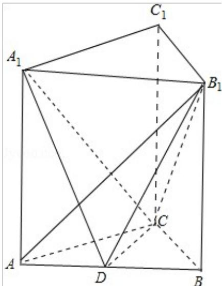

<!-- question-source:start -->
20.（12分）(2012·重庆)如图，在直三棱柱 $\mathrm{ABC - A_1B_1C_1}$ 中， $\mathrm{AB} = 4$ ， $\mathrm{AC} = \mathrm{BC} = 3$ ，D为AB的中点.

（Ⅰ）求异面直线 $CC_{1}$ 和 AB 的距离；

（Ⅱ）若 $AB_{1} \perp A_{1}C$ ，求二面角 $A_{1} - CD - B_{1}$ 的平面角的余弦值.

<!-- question-source:end -->

![[高中/真题/按年份分类/2012/2012年重庆市高考数学试卷_文科_含答案/填空题/题目/answers/Q00022903A1.md]]
