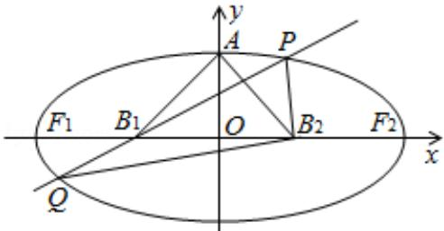

<!-- question-source:start -->
21. (12 分) (2012·重庆) 如图, 设椭圆的中心为原点 O, 长轴在 x 轴上, 上顶点为 A, 左、右焦点分别为 $F_{1}, F_{2}$ , 线段 $OF_{1}, OF_{2}$ 的中点分别为 $B_{1}, B_{2}$ , 且 $\triangle AB_{1}B_{2}$ 是面积为 4 的直角三角形.

(I) 求该椭圆的离心率和标准方程;

（Ⅱ）过 $B_{1}$ 作直线交椭圆于 P，Q 两点，使 $PB_{2}\perp QB_{2}$ ，求 $\triangle PB_{2}Q$ 的面积.

# 2012 年重庆市高考数学试卷（文科）

参考答案与试题解析

##
一、选择题（共10小题，每小题5分，满分50分）
<!-- question-source:end -->

![[高中/真题/按年份分类/2012/2012年重庆市高考数学试卷_文科_含答案/填空题/题目/answers/Q00031035A1.md]]
