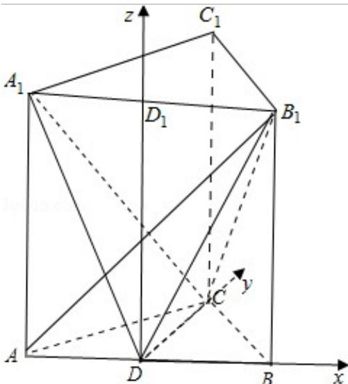
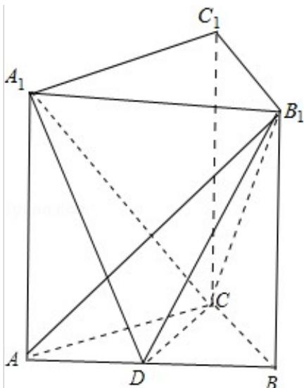

> [!faq]- 2012年重庆市高考数学试卷(文科)含答案解析
>
> > [!success]- **【答案】** 详见解析
>
> > [!note]- **【分析】**
> > （Ⅰ）先根据条件得到CD⊥AB以及CC₁⊥CD，进而求出C的长即可；
>
> > [!note]- **【解析】**
> > 分析：（Ⅰ）先根据条件得到CD⊥AB以及CC₁⊥CD，进而求出C的长即可；
> >
> > （Ⅱ）解法一；先根据条件得到 $\angle A_{1}DB_{1}$ 为所求的二面角 $A_{1}-CD-B_{1}$ 的平面角，再根据三角形相似求出棱柱的高，进而在三角形 $A_{1}DB_{1}$ 中求出结论即可；
> >
> > 解法二：过 D 作 $DD_{1}\|AA_{1}$ 交 $A_{1}B_{1}$ 于 $D_{1}$ ，建立空间直角坐标系，求出两个平面的法向量的坐标，最后代入向量的夹角计算公式即可求出结论.
> >
> > 解答: 解: (Ⅰ) 解: 因为 AC=BC, D 为 AB 的中点, 故 CD⊥AB,
> >
> > 又直三棱柱中， $CC_{1}$ ⊥ 面 ABC，故 $CC_{1}$ ⊥ CD，
> >
> > 所以异面直线 $CC_{1}$ 和 AB 的距离为： $CD=\sqrt{BC^{2}-BD^{2}}=\sqrt{5}$ .
> >
> > （Ⅱ）解法一；由 CD⊥AB，CD⊥BB₁，故 CD⊥平面 A₁ABB₁，
> >
> > 从而 $CD \perp DA_{1}$ ， $CD \perp DB_{1}$ ，故 $\angle A_{1}DB_{1}$ 为所求的二面角 $A_{1}-CD-B_{1}$ 的平面角.
> >
> > 因 $\mathrm{A}_1\mathrm{D}$ 是 $\mathrm{A}_1\mathrm{C}$ 在面 $\mathrm{A}_1\mathrm{ABB}_1$ 上的射影，
> >
> > 又已知 $AB_{1} \perp A_{1}C$ ，由三垂线定理的逆定理得 $AB_{1} \perp A_{1}D$ ，
> >
> > 从而 $\angle A_{1}AB_{1}$ ， $\angle A_{1}DA$ 都与 $\angle B_{1}AB$ 互余，
> >
> > 因此 $\angle A_{1}AB_{1} = \angle \angle A_{1}DA$
> >
> > 所以 $\mathrm{RT}\triangle \mathrm{A}_1\mathrm{AD} \sim \mathrm{RT}\triangle \mathrm{B}_1\mathrm{A}_1\mathrm{A}$ ,
> >
> > 因此 $\frac{\mathrm{AA}_{1}}{\mathrm{AD}} = \frac{\mathrm{A}_{1}\mathrm{B}_{1}}{\mathrm{AA}_{1}}$ ，得 $\mathrm{AA}_{1}^{2} = \mathrm{AD}\cdot \mathrm{A}_{1}\mathrm{B}_{1} = 8,$
> >
> > 从而 $\mathrm{A}_1\mathrm{D} = \sqrt{\mathrm{AA}_1^2 + \mathrm{AD}^2} = 2\sqrt{3},$ $\mathrm{B_1D = A_1D = 2\sqrt{3}}.$
> >
> > 所以在三角形 $\mathrm{A}_1\mathrm{DB}_1$ 中， $\cos \angle \mathrm{A}_1\mathrm{DB}_1 = \frac{\mathrm{A}_1\mathrm{D}^2 + \mathrm{DB}_1^2 - \mathrm{A}_1\mathrm{B}_1^2}{2*\mathrm{A}_1\mathrm{D}*\mathrm{DB}_1} = \frac{1}{3}$ .
> >
> > 解法二：过 D 作 $DD_{1}\|AA_{1}$ 交 $A_{1}B_{1}$ 于 $D_{1}$ ，在直三棱柱中，
> >
> > 由第一问知: DB, DC, $DD_{1}$ 两两垂直, 以 D 为原点, 射线 DB, DC, $DD_{1}$ 分别为 X 轴, Y 轴, Z 轴建立空间直角坐标系 D - XYZ.
> >
> > 设直三棱柱的高为 h，则 A $(-2,0,0)$ ， $A_{1}(-2,0,h)$ 。 $B_{1}(2,0,h)$ 。C $(0,\sqrt{5},0)$ 从而 $\overrightarrow{AB_{1}}=(4,0,h)$ ， $\overrightarrow{A_{1}C}=(2,\sqrt{3},-h)$ 。
> >
> > 由 $AB_{1}\perp A_{1}C$ 得 $\overrightarrow{AB_{1}}\cdot\overrightarrow{A_{1}C}=0$ ，即 $8-h^{2}=0$ ，因此 $h=2\sqrt{2}$ ，
> >
> > 故 $\overrightarrow{DA_{1}}=(-1,0,2\sqrt{2})$ ， $\overrightarrow{DB_{1}}=(2,0,2\sqrt{2})$ ， $\overrightarrow{DC}=(0,\sqrt{5},0)$ 。
> >
> > 设平面 $A_{1}CD$ 的法向量为 $\vec{\pi}=(x,y,z)$ ，则 $\vec{\pi}\perp\overrightarrow{DC}$ ， $\vec{\pi}\perp\overrightarrow{DA_{1}}$ ，即 $\left\{\begin{aligned}\sqrt{5}y=0\\ -2x+2\sqrt{2}z=0\end{aligned}\right.$ 取 z=1，得 $\vec{\pi}=(\sqrt{2},0,1)$ ，
> >
> > 设平面 $B_{1}CD$ 的法向量为 $\vec{n}=(a,b,c)$ ，则 $\vec{n}\perp\overrightarrow{DC}$ ， $\vec{n}\perp\overrightarrow{DB_{1}}$ ，即 $\left\{\begin{aligned}\sqrt{5}b=0\\ 2a+2\sqrt{2}c=0\end{aligned}\right.$ 取 c=-1 得 $\vec{n}=(\sqrt{2},0,-1)$ ，
> >
> > 所以 $\cos<\vec{n}$ ， $\vec{n}>=\frac{\vec{m}\cdot\vec{n}}{|\vec{m}||\vec{n}|}=\frac{2-1}{\sqrt{2+1}\cdot\sqrt{2+1}}=\frac{1}{3}$ 所以二面角的平面角的余弦值为 $\frac{1}{3}$ .
> >
> > 
> >
> > 
> >
> > 点评：本题主要考察异面直线间的距离计算以及二面角的平面角及求法。在求异面直线间的距离时，关键是求出异面直线的公垂线。
