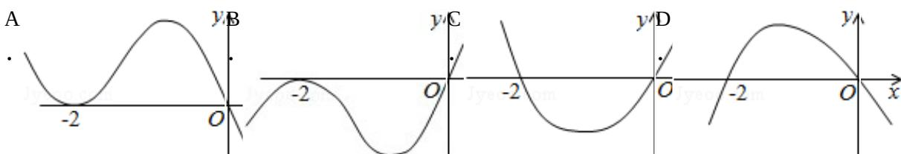

<!-- question-source:start -->
8. (5 分) (2012·重庆) 设函数 $f(x)$ 在 $R$ 上可导, 其导函数为 $f'(x)$ , 且函数 $f(x)$ 在 $x = -2$ 处取得极小值, 则函数 $y = xf'(x)$ 的图象可能是 ( )

考点: 利用导数研究函数的单调性.

专题：证明题.
<!-- question-source:end -->

![[高中/真题/按年份分类/2012/2012年重庆市高考数学试卷_文科_含答案/选择题/题目/answers/Q00028122A1.md]]
