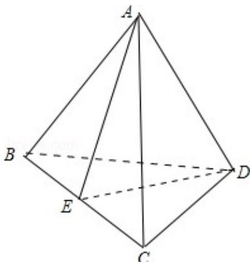

> [!faq]- 2012年重庆市高考数学试卷(文科)含答案解析
>
> > [!success]- **【答案】** .
>
> > [!note]- **【分析】**
> > 先在三角形 BCD 中求出 a 的范围，再在三角形 AED 中求出 a 的范围，二者相结合即可得到
>
> > [!note]- **【解析】**
> > 解：设四面体的底面是BCD， $\mathrm{BC = a}$ ， $\mathrm{BD = CD = 1}$ ，顶点为A， $\mathrm{AD} = \sqrt{2}$
> >
> > 在三角形 BCD 中，因为两边之和大于第三边可得：0 < a < 2
> > (1)
> >
> > 取 BC 中点 E，∵E 是中点，直角三角形 ACE 全等于直角 DCE，
> >
> > 所以在三角形AED中， $\mathrm{AE} = \mathrm{ED} = \sqrt{1 - \left(\frac{a}{2}\right)^2}$
> >
> > ∵两边之和大于第三边
> >
> > $\therefore \sqrt{2} < 2\sqrt{1 - (\frac{a}{2})^{2}}$ 得 $0 < a < \sqrt{2}$ （负值0值舍）
> > (2)
> >
> > 由（1）
> > （2）得 $0 < a < \sqrt{2}$
> >
> > 故选：A.
> >
> > 
> >
> > 点评：本题主要考察三角形三边关系以及异面直线的位置．解决本题的关键在于利用三角形两边之和大于第三边这一结论.
