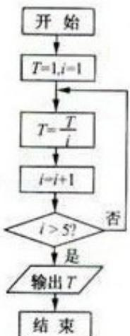

> [!faq]- 2012年高考浙江文科数学试题及答案(精校版)解析
>
> > [!success]- **【答案】** $\frac{1}{120}$
>
> > [!note]- **【分析】**
> > 通过循环框图，计算循环变量的值，当 $i = 6$ 时结束循环，输出结果即可.
>
> > [!note]- **【解析】**
> > 解：循环前，T=1，i=2，不满足判断框的条件，第1次循环， $T=\frac{1}{2}$ ，i=3，
> >
> > 不满足判断框的条件，第2次循环， $T=\frac{1}{6}$ ，i=4，
> >
> > 不满足判断框的条件，第3次循环， $T=\frac{1}{24}$ ，i=5，
> >
> > 不满足判断框的条件，第4次循环， $T=\frac{1}{120}$ ，i=6，
> >
> > 满足判断框的条件，退出循环，输出结果 $\frac{1}{120}$
> >
> > 故答案为： $\frac{1}{120}$
> >
> > 
> >
> > 点评：本题考查循环结构的应用，注意循环的变量的计算，考查计算能力.
