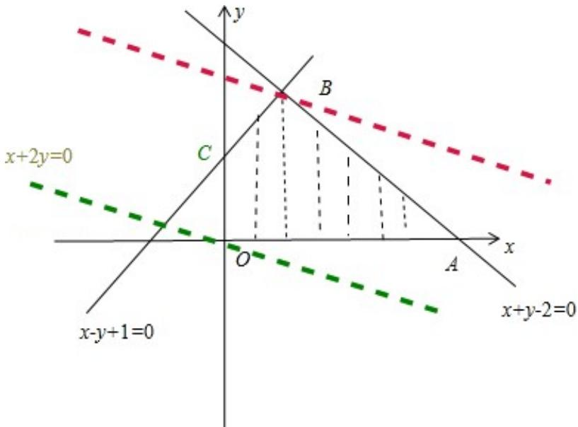

> [!faq]- 2012年高考浙江文科数学试题及答案(精校版)解析
>
> > [!success]- **【答案】** 为： $[0, \frac{7}{2} ]$  点评：用图解法解决线性规划问题时，
>
> > [!note]- **【分析】**
> > 根据已知的约束条件画出满足约束条件的可行域，结合 z 在目标函数中的几何意义，求出目标函数的最大值、及最小值，进一步线出目标函数 z 的范围.
>
> > [!note]- **【解析】**
> > 分析：根据已知的约束条件画出满足约束条件的可行域，结合 z 在目标函数中的几何意义，求出目标函数的最大值、及最小值，进一步线出目标函数 z 的范围.
> >
> > 解答：
> >
> > 解：约束条件 $\left\{\begin{aligned}x-y+1&\geqslant0\\ x+y-2&\leqslant0\\ x&\geqslant0\\ y&\geqslant0\end{aligned}\right.$ 对应的平面区域如图示：
> >
> > 由图易得目标函数 $z=2y+x$ 在 O（0，0）处取得最小值，此时 z=0
> >
> > 在B处取最大值，由 $\left\{ \begin{array}{l} x - y + 1 = 0 \\ x + y - 2 = 0 \end{array} \right.$ 可得B（ $\frac{1}{2}, \frac{3}{2}$ ），此时 $z = \frac{7}{2}$
> >
> > 故 $Z = x + 2y$ 的取值范围为： $[0, \frac{7}{2} ]$
> >
> > 故
> > 答案为： $[0, \frac{7}{2} ]$
> >
> > 
> >
> > 点评：用图解法解决线性规划问题时，
> > 分析题目的已知条件，找出约束条件，利用目标函数中 $z$ 的几何意义是关键.
