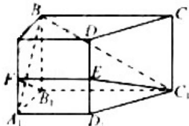

<!-- question-source:start -->
20. （2012·浙江）如图，在侧棱垂直底面的四棱柱 $ABCD-A_{1}B_{1}C_{1}D_{1}$ 中，AD∥BC，AD⊥AB， $AB=\sqrt{2}$ AD=2, BC=4, $AA_{1}=2$ , E 是 $DD_{1}$ 的中点，F 是平面 $B_{1}C_{1}E$ 与直线 $AA_{1}$ 的交点.

(1) 证明:

(i) $EF\|A_{1}D_{1};$

(ii) $BA_{1} \perp$ 平面 $B_{1}C_{1}EF$ ;

(2) 求 $\mathrm{BC}_{1}$ 与平面 $\mathrm{B}_{1} \mathrm{C}_{1} \mathrm{EF}$ 所成的角的正弦值.

<!-- question-source:end -->

![[高中/真题/按年份分类/2012/2012年高考浙江文科数学试题及答案_精校版_/解答题/题目/answers/Q00023569A1.md]]
