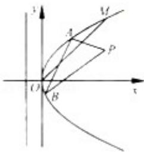

<!-- question-source:start -->
22. (2012·浙江) 如图, 在直角坐标系 xOy 中, 点 P $(1, \frac{1}{2})$ 到抛物线 C: $y^{2} = 2px (P > 0)$ 的准线的距离为 $\frac{5}{4}$ . 点 M (t, 1) 是 C 上的定点, A, B 是 C 上的两动点, 且线段 AB 被直线 OM 平分.

(1) 求 p, t 的值.

(2) 求 $\triangle ABP$ 面积的最大值.

# 2012 年浙江省高考数学试卷（文科）

参考
<!-- question-source:end -->

![[高中/真题/按年份分类/2012/2012年高考浙江文科数学试题及答案_精校版_/解答题/题目/answers/Q00023571A1.md]]
