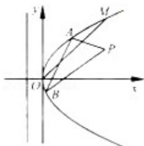

> [!faq]- 2012年高考浙江文科数学试题及答案(精校版)解析
>
> > [!success]- **【答案】** 详见解析
>
> > [!note]- **【分析】**
> > (1) 通过点 P $(1, \frac{1}{2})$ 到抛物线 C: $y^{2} = 2px$ (P > 0) 的准线的距离为 $\frac{5}{4}$ . 列出方程，求出 p, t 的值即可.
>
> > [!note]- **【解析】**
> > 分析:
> >
> > (1) 通过点 P $(1, \frac{1}{2})$ 到抛物线 C: $y^{2} = 2px$ (P > 0) 的准线的距离为 $\frac{5}{4}$ . 列出方程，求出 p, t 的值即可.
> >
> > (2) 设 A $(x_{1}, y_{1})$ $(x_{2}, y_{2})$ ，线段 AB 的中点为 Q (m, m)，设直线 AB 的斜率为 k， $(k \neq 0)$ ，利用 $\left\{\begin{aligned}y_{1}^{2}&=x_{1}\\ y_{2}^{2}&=x_{2}\end{aligned}\right.$ 推出 AB 的方程 $y - m = \frac{1}{2m} (x - m)$ . 利用弦长公式求出 |AB|，设点 P 到直线 AB 的距离为 d，利用点到直线的距离公式求出 d，设 $\triangle ABP$ 的面积为 S，求出 $S = \frac{1}{2}|AB| \cdot d = |1 - 2(m - m^{2})| \cdot \sqrt{m - m^{2}}$ . 利用函数的导数求出 $\triangle ABP$ 面积的最大值.
> >
> > 解答：
> >
> > 解：（1）由题意可知 $\left\{\begin{aligned}&2p t=1\\ &1+\frac{p}{2}=\frac{5}{4}\end{aligned}\right.$ 得， $\left\{\begin{aligned}&p=\frac{1}{2}\\ &t=1\end{aligned}\right.$
> >
> > (2) 设 A $(x_{1}, y_{1})$ $(x_{2}, y_{2})$ ，线段 AB 的中点为 Q（m，m），由题意可知，设直线 AB 的斜率为 k， $(k \neq 0)$ ，
> >
> > 由 $\left\{\begin{aligned}y_{1}^{2}&=x_{1}\\ y_{2}^{2}&=x_{2}\end{aligned}\right.$ 得， $(y_{1}-y_{2})$ $(y_{1}+y_{2})=x_{1}-x_{2},$
> >
> > 故 $\mathrm{k}\cdot 2\mathrm{m} = 1$
> >
> > 所以直线 AB 方程为 $y - m = \frac{1}{2m} (x - m)$ .
> >
> > 即 $\triangle = 4\mathrm{m} - 4\mathrm{m}^2 >0$ ， $\mathrm{y_1 + y_2 = 2m}$ ， $\mathrm{y_1y_2 = 2m^2 - m}$
> >
> > 从而 $|\mathrm{AB}| = \sqrt{1 + \frac{1}{\mathrm{k}^2}}\cdot |\mathrm{y}_1 - \mathrm{y}_2| = \sqrt{1 + 4\mathrm{m}^2}\cdot \sqrt{4\mathrm{m} - 4\mathrm{m}^2},$
> >
> > 设点 P 到直线 AB 的距离为 d，则
> >
> > $\mathrm{d} = \frac{\left|1 - 2\pi + 2\mathrm{m}^2\right|}{\sqrt{1 + 4\mathrm{m}^2}}$
> >
> > 设 $\triangle ABP$ 的面积为 $S$ ，则
> >
> > $$
> > S = \frac {1}{2} | A B | \cdot d = | 1 - 2 (m - m ^ {2}) | \cdot \sqrt {m - m ^ {2}}.
> > $$
> >
> > 由 $\triangle = \sqrt{\mathfrak{m} - \mathfrak{m}^2} > 0$ ，得 $0 < \mathrm{m} < 1$
> >
> > 令 $u = \sqrt{m - m^2}$ ， $0 <   u <   \frac{1}{2}$ 则 $S = u(1 - 2u^2)$ ， $0 <   u <   \frac{1}{2},$
> >
> > 则 $S'(u)=1-6u^{2}$ ， $S'(u)=0$ ，得 $u=\frac{\sqrt{6}}{6}\in(0,\frac{1}{2})$ ，
> >
> > 所以 $S_{最大值}=S\left(\frac{\sqrt{6}}{6}\right)=\frac{\sqrt{6}}{9}$ .
> >
> > 故 $\triangle ABP$ 面积的最大值为 $\frac{\sqrt{6}}{9}$ .
> >
> > 
> >
> > 点评：本题考查直线与圆锥曲线的综合问题，抛物线的简单性质，函数与导数的应用，函数的最大值的求法，考查
> > 分析问题解决问题的能力。
