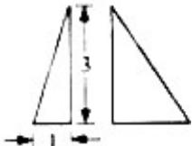
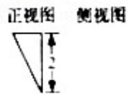

<!-- question-source:start -->
3. （2012·浙江）已知某三棱锥的三视图（单位：cm）如图所示，则该三棱锥的体积是（）

俯视图A. $1\mathrm{cm}^3$ B. $2\mathrm{cm}^3$ C. $3\mathrm{cm}^3$ D. $6\mathrm{cm}^3$
<!-- question-source:end -->

![[高中/真题/按年份分类/2012/2012年高考浙江文科数学试题及答案_精校版_/选择题/题目/answers/Q00023552A1.md]]
