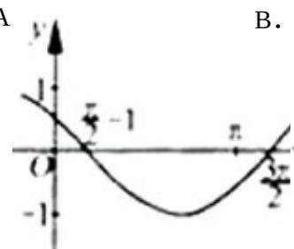
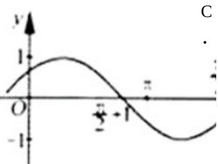
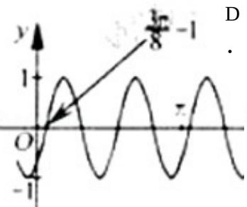
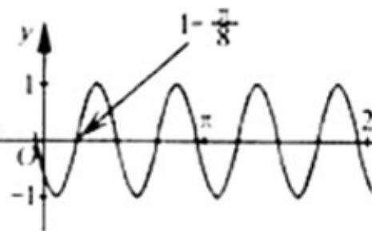

<!-- question-source:start -->
6.（2012·浙江）把函数 $y = \cos 2x + 1$ 的图象上所有点的横坐标伸长到原来的2倍（纵坐标不变），然后向左平移1个单位长度，再向下平移1个单位长度，得到的图象是（）

A

B.

<!-- question-source:end -->

![[高中/真题/按年份分类/2012/2012年高考浙江文科数学试题及答案_精校版_/选择题/题目/answers/Q00023555A1.md]]
