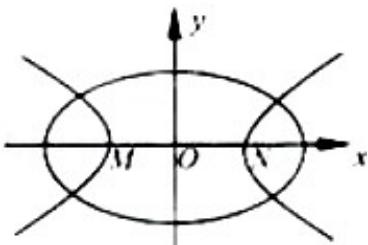

<!-- question-source:start -->
8. (2012·浙江) 如图, 中心均为原点 O 的双曲线与椭圆有公共焦点, M, N 是双曲线的两顶点. 若 M, O, N 将椭圆长轴四等分, 则双曲线与椭圆的离心率的比值是 ( )

A. 3 B. 2 C. $\sqrt{3}$ D. $\sqrt{2}$
<!-- question-source:end -->

![[高中/真题/按年份分类/2012/2012年高考浙江文科数学试题及答案_精校版_/选择题/题目/answers/Q00023557A1.md]]
