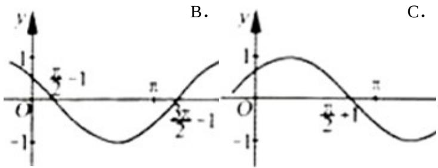
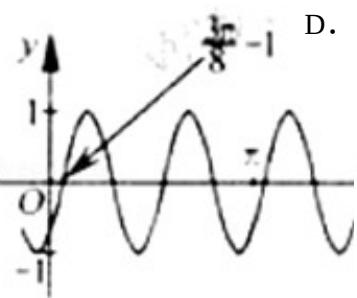
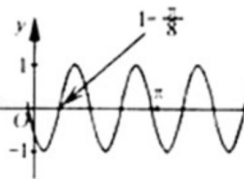

<!-- question-source:start -->
6. (2012·浙江) 把函数 $y = \cos 2x + 1$ 的图象上所有点的横坐标伸长到原来的 2 倍 (纵坐标不变)，然后向左平移 1 个单位长度，再向下平移 1 个单位长度，得到的图象是（）

A.

考点：函数 $y=Asin\left(\omega x+\varphi\right)$ 的图象变换。

专题：证明题；综合题。
<!-- question-source:end -->

![[高中/真题/按年份分类/2012/2012年高考浙江文科数学试题及答案_精校版_/选择题/题目/answers/Q00028132A1.md]]
