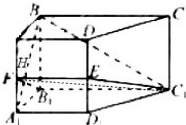

> [!faq]- 2012年高考浙江文科数学试题及答案(精校版)解析
>
> > [!success]- **【答案】** 详见解析
>
> > [!note]- **【分析】**
> > 本题未单列分析。
>
> > [!note]- **【解析】**
> > （1）证明（i）∵ $C_{1}B_{1}\|A_{1}D_{1}$ ， $C_{1}B_{1}\not\subset$ 平面 $ADD_{1}A_{1}$ ，∴ $C_{1}B_{1}\|$ 平面 $ADD_{1}A_{1}$ ，
> >
> > 又 $C_{1}B_{1}\subset$ 平面 $B_{1}C_{1}EF$ ，平面 $B_{1}C_{1}EF\cap$ 平面平面 $ADD_{1}A_{1}=EF$ ，
> >
> > $\therefore \mathrm{C}_{1}\mathrm{B}_{1}\| \mathrm{EF},\therefore \mathrm{EF}\| \mathrm{A}_{1}\mathrm{D}_{1};$
> >
> > (ii) $\because BB_{1}\perp$ 平面 $A_{1}B_{1}C_{1}D_{1}, \therefore BB_{1}\perp B_{1}C_{1},$
> >
> > 又∵ $B_{1}C_{1}\perp B_{1}A_{1}$ ,
> >
> > $\therefore B_{1}C_{1}\perp$ 平面 $ABB_{1}A_{1}$ ,
> >
> > $$
> > \therefore \mathrm{B} _ {1} \mathrm{C} _ {1} \perp \mathrm{BA} _ {1}
> > $$
> >
> > 在矩形 $ABB_{1}A_{1}$ 中，F 是 $AA_{1}$ 的中点， $\tan\angle A_{1}B_{1}F=\tan\angle AA_{1}B=\frac{\sqrt{2}}{2}$ ，即 $\angle A_{1}B_{1}F=\angle AA_{1}B$ ，故 $BA_{1}\perp B_{1}F$ 。所以 $BA_{1}\perp$ 平面 $B_{1}C_{1}EF$ ；
> > (2) 解: 设 $\mathrm{BA}_{1}$ 与 $\mathrm{B}_{1} \mathrm{~F}$ 交点为 $\mathrm{H}$ ,
> >
> > 连接 $\mathrm{C_1H}$ ，由
> > （1）知 $\mathrm{BA}_1\bot$ 平面 $\mathrm{B_1C_1EF}$ ，所以 $\angle \mathrm{BC}_1\mathrm{H}$ 是 $\mathrm{BC}_1$ 与平面 $\mathrm{B_1C_1EF}$ 所成的角.
> >
> > 在矩形 $\mathrm{AA}_1\mathrm{B}_1\mathrm{B}$ 中， $\mathrm{AB} = \sqrt{2}$ ， $\mathrm{AA}_1 = 2$ ，得 $\mathrm{BH} = \frac{4}{\sqrt{6}}$
> >
> > 在 $\mathrm{RT}\triangle \mathrm{BHC}_1$ 中， $\mathrm{BC}1 = 2\sqrt{5}$ ， $\sin \angle \mathrm{BC}_1\mathrm{H} = \frac{\mathrm{BH}}{\mathrm{BC}_1} = \frac{\sqrt{30}}{15},$
> >
> > 所以 $\mathrm{BC}_1$ 与平面 $\mathrm{B_1C_1EF}$ 所成的角的正弦值是 $\frac{\sqrt{30}}{15}$ .
> >
> > 
> >
> > 点评：本题考查空间直线、平面位置故选的判定，线面角求解。考查空间想象能力、推理论证能力、转化、计算能力。
