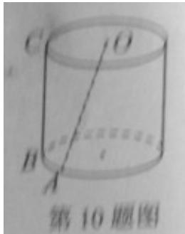

<!-- question-source:start -->
12. 设 AB 是椭圆 $\Gamma$ 的长轴, 点 C 在 $\Gamma$ 上, 且 $\angle CBA = \frac{\pi}{4}$ . 若 AB = 4, $BC = \sqrt{2}$ , 则 $\Gamma$ 的两个焦点之间的距离为 \_\_\_\_.

<!-- question-source:end -->

![[高中/真题/按年份分类/2013/2013年上海高考数学真题_文科_试卷_word解析版_/填空题/题目/answers/Q00023841A1.md]]
