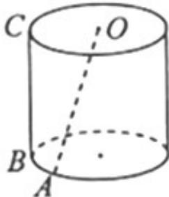

<!-- question-source:start -->
10. 已知圆柱 $\Omega$ 的母线长为 I，底面半径为 $r, O$ 是上底面圆心，A、B 是下底面圆周上的两个不同的点，BC 是母线，如图。若直线 OA 与 BC 所成角的大小为 $\frac{\pi}{6}$ ，则 $\frac{l}{r} = -\sqrt{3}$ 。

  
第10题图

【
<!-- question-source:end -->

![[高中/真题/按年份分类/2013/2013年上海高考数学真题_文科_试卷_word解析版_/填空题/题目/answers/Q00028153A1.md]]
