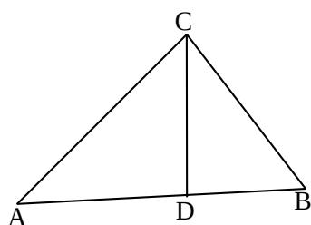

> [!faq]- 2013年上海高考数学真题（文科）试卷（word解析版）解析
>
> > [!success]- **【答案】** $\frac{5}{7}$
>
> > [!note]- **【分析】**
> > 本题未单列分析。
>
> > [!note]- **【解析】**
> > 考查排列组合；概率计算策略：正难则反。
> >
> > 从4个奇数和3个偶数共7个数中任取2个，共有 $C_{7}^{2}=21$ 个2个数之积为奇数 $\Rightarrow2$ 个数分别为奇数，共有 $C_{4}^{2}=6$ 个.
> >
> > 所以2个数之积为偶数的概率 $P=1-\frac{C_{4}^{2}}{C_{7}^{2}}=1-\frac{6}{21}=\frac{5}{7}$
> >
> > 
