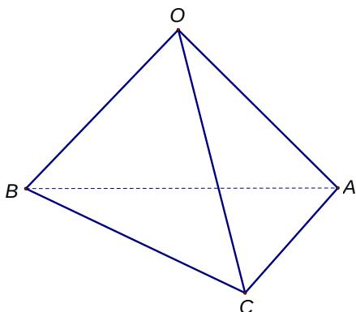

<!-- question-source:start -->
19. (本题满分 12 分)

如图, 正三棱锥 O - ABC 底面边长为 2, 高为 1, 求该三棱锥的体积及表面积.

<!-- question-source:end -->

![[高中/真题/按年份分类/2013/2013年上海高考数学真题_文科_试卷_word解析版_/解答题/题目/answers/Q00023848A1.md]]
