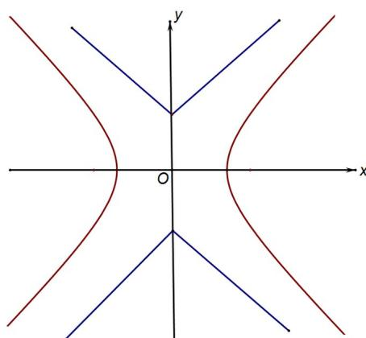

<!-- question-source:start -->
23.（本题满分18分）本题共有3个小题．第1小题满分3分，第2小题满分6分，第3小题满分9分．

如图, 已知双曲线 $C_{1}: \frac{x^{2}}{2} - y^{2} = 1$ , 曲线 $C_{2}: |y| \neq x| + 1$ . $P$ 是平面内一点, 若存在过点 $P$ 的直线与 $C_{1}$ 、 $C_{2}$ 都有公共点, 则称 $P$ 为 “ $C_{1} - C_{2}$ 型点”.

  
第23题图
<!-- question-source:end -->

![[高中/真题/按年份分类/2013/2013年上海高考数学真题_文科_试卷_word解析版_/选择题/题目/answers/Q00028163A1.md]]
