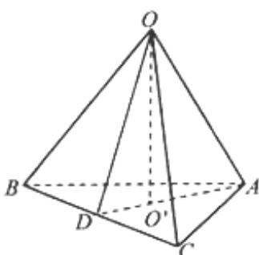

> [!faq]- 2013年上海高考数学真题（文科）试卷（word解析版）解析
>
> > [!success]- **【答案】** (本题满分
>
> > [!note]- **【分析】**
> > 本题解析推导如下：
>
> > [!note]- **【解析】**
> > [解] 由已知条件可知，正三棱锥 O-ABC 的底面 $\triangle ABC$ 是边长为 2 的正三角形，
> > 经计算得底面 $\triangle ABC$ 的面积为 $\sqrt{3}$ . …… 2 分
> > 所以该三棱锥的体积为 $\frac{1}{3} \times \sqrt{3} \times 1 = \frac{\sqrt{3}}{3}$ . …… 4 分
> > 设 $O'$ 是正三角形 ABC 的中心.
> > 由正三棱锥的性质可知， $OO'$ 垂直于平面 ABC.
> > 延长 $AO'$ 交 BC 于 D，得 $AD = \sqrt{3}$ ， $O'D = \frac{\sqrt{3}}{3}$ .
> > 又因为 $OO' = 1$ ，所以正三棱锥的斜高 $OD = \frac{2\sqrt{3}}{3}$ .
> >
> >   
> > 第19题图
> >
> > 延长 $AO'$ 交BC于D，得 $AD=\sqrt{3}$ ， $O'D=\frac{\sqrt{3}}{3}$ 。
> > ……7分
> > 又因为 $OO'=1$ ，所以正三棱锥的斜高 $OD=\frac{2\sqrt{3}}{3}$ 。
> > ……9分
> >
> > 故侧面积为 $\frac{1}{2} \times 6 \times \frac{2\sqrt{3}}{3} = 2\sqrt{3}$ .
> >
> > 所以该三棱锥的表面积为 $\sqrt{3} + 2\sqrt{3} = 3\sqrt{3}$ , 因此, 所求三棱锥的体积为 $\frac{\sqrt{3}}{3}$ , 表面积为 $3\sqrt{3}$ .
> >
> > …… 12分
