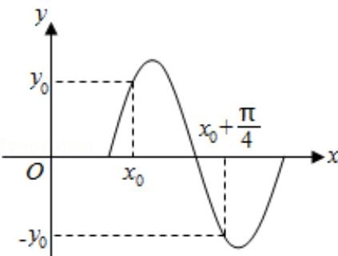

# 2013 年全国统一高考数学试卷（文科）（大纲版）

项是符合题目要求的.

1. （5分）设集合 $U = \{1, 2, 3, 4, 5\}$ ，集合 $A = \{1, 2\}$ ，则 $C_U A = (\quad)$ A. $\{1, 2\}$ B. $\{3, 4, 5\}$ C. $\{1, 2, 3, 4, 5\}$ D. $\varnothing$

2. （5分）若 $\alpha$ 为第二象限角， $\sin \alpha = \frac{5}{13}$ ，则 $\cos \alpha = (\quad)$ A. $-\frac{12}{13}$ B. $-\frac{5}{13}$ C. $\frac{5}{13}$ D. $\frac{12}{13}$

3. (5分) 已知向量 $\vec{\pi} = (\lambda + 1, 1)$ , $\vec{n} = (\lambda + 2, 2)$ , 若 $(\vec{n} + \vec{n}) \perp (\vec{n} - \vec{n})$ , 则 $\lambda = (\quad)$ A. -4 B. -3 C. -2 D. -1

4. （5分）不等式 $|x^{2} - 2| < 2$ 的解集是（）
A. $(-1, 1)$ B. $(-2, 2)$ C. $(-1, 0) \cup (0, 1)$ D. $(-2, 0) \cup$

(0, 2)

5. (5 分) $(x + 2)^8$ 的展开式中 $x^6$ 的系数是 ( )

A. 28 B. 56 C. 112 D. 224

6. (5分) 函数 $f(x) = \log_2(1 + \frac{1}{x}) \quad (x > 0)$ 的反函数 $f^{-1}(x) = (\quad)$ A. $\frac{1}{2^x - 1} (x > 0)$ B. $\frac{1}{2^x - 1} (x \neq 0)$ C. $2^x - 1 (x \in \mathbb{R})$ D. $2^x - 1 (x > 0)$

7.（5分）已知数列 $\{a_{n}\}$ 满足 $3a_{n + 1} + a_n = 0$ ， $a_2 = -\frac{4}{3}$ ，则 $\{a_{n}\}$ 的前10项和等于（

A. -6 $(1 - 3^{-10})$ B. $\frac{1}{9}(1 - 3^{-10})$ C. 3 $(1 - 3^{-10})$ D. 3 $(1 + 3^{-10})$

8. (5分) 已知 $F_{1}(-1,0), F_{2}(1,0)$ 是椭圆 C 的两个焦点, 过 $F_{2}$ 且垂直于 x 轴的直线交椭圆于 A、B 两点, 且 $|AB|=3$ , 则 C 的方程为 ( )

A. $\frac{x^{2}}{2}+y^{2}=1$ B. $\frac{x^{2}}{3}+\frac{y^{2}}{2}=1$ C. $\frac{x^{2}}{4}+\frac{y^{2}}{3}=1$ D. $\frac{x^{2}}{5}+\frac{y^{2}}{4}=1$

9. （5分）若函数 $y = \sin (\omega x + \varphi) \quad (\omega > 0)$ 的部分图象如图，则 $\omega = (\quad)$

A. 5 B. 4 C. 3 D. 2

10. (5 分) 已知曲线 $y = x^{4} + ax^{2} + 1$ 在点 $(-1, a + 2)$ 处切线的斜率为 8, $a =$ ( )
A. 9 B. 6 C. -9 D. -6

11. (5分) 已知正四棱柱 $ABCD - A_{1}B_{1}C_{1}D_{1}$ 中, $AA_{1} = 2AB$ , 则 $CD$ 与平面 $BDC_{1}$ 所成角的正弦值等于 ( )

A. $\frac{2}{3}$ B. $\frac{\sqrt{3}}{3}$ C. $\frac{\sqrt{2}}{3}$ D. $\frac{1}{3}$

12. (5 分) 已知抛物线 C: $y^{2}=8x$ 的焦点为 F，点 M(-2,2)，过点 F 且斜率为 k 的直线与 C 交于 A，B 两点，若 $\overrightarrow{MA} \cdot \overrightarrow{MB} = 0$ ，则 k = （）

A. $\sqrt{2}$ B. $\frac{\sqrt{2}}{2}$ C. $\frac{1}{2}$ D. 2

![[高中/真题/按年份分类/2013/2013年全国统一高考数学试卷_文科__大纲版__含解析版_/填空题/填空题.md]]
![[高中/真题/按年份分类/2013/2013年全国统一高考数学试卷_文科__大纲版__含解析版_/解答题/解答题.md]]
![[高中/真题/按年份分类/2013/2013年全国统一高考数学试卷_文科__大纲版__含解析版_/选择题/选择题.md]]
