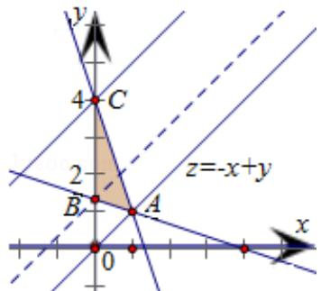

> [!faq]- 2013年全国统一高考数学试卷（文科）（大纲版）（含解析版）解析
>
> > [!success]- **【答案】** 0
>
> > [!note]- **【分析】**
> > 作出题中不等式组表示的平面区域, 得如图的 $\triangle ABC$ 及其内部, 再将目标
>
> > [!note]- **【解析】**
> > 解：作出不等式组 $\left\{\begin{aligned}x&\geqslant0\\ x+3y&\geqslant4\\ 3x+y&\leqslant4\end{aligned}\right.$ 表示的平面区域，
> >
> > 
> >
> > 得到如图的△ABC及其内部，其中A（1，1），B（0， $\frac{4}{3}$ ），C（0，4）
> >
> > 设 $z=F(x,y)=-x+y$ ，将直线 l: $z=-x+y$ 进行平移，
> >
> > 当 I 经过点 A 时，目标函数 z 达到最小值
> >
> > $$
> > \therefore z _ {\text {最小值}} = F (1, 1) = - 1 + 1 = 0
> > $$
> >
> > 故答案为：0
> >
> > 【点评】题给出二元一次不等式组，求目标函数 $z = -x + y$ 的最小值，着重考查了二
> >
> > 元一次不等式组表示的平面区域和简单的线性规划等知识，属于基础题.
